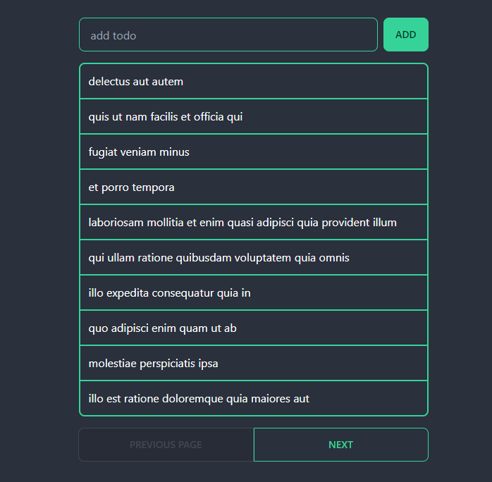

# react-query-demo
simple todo for a react-query demo

## Screenshot

### App Page

### Tech Stack:

- React
- Vite
- TypeScript
- React Query
- Axios
- Tailwind CSS
- DaisyUI

### Install and Run:
- Install 'npm i'
- Run 'npm start'
- Run 'npm test'

### Use of the reactquery devtools:
- https://scribehow.com/shared/Steps_to_Add_a_Todo_on_Localhost_Website__vy6lV-72T-WUXEwOzXgKvw